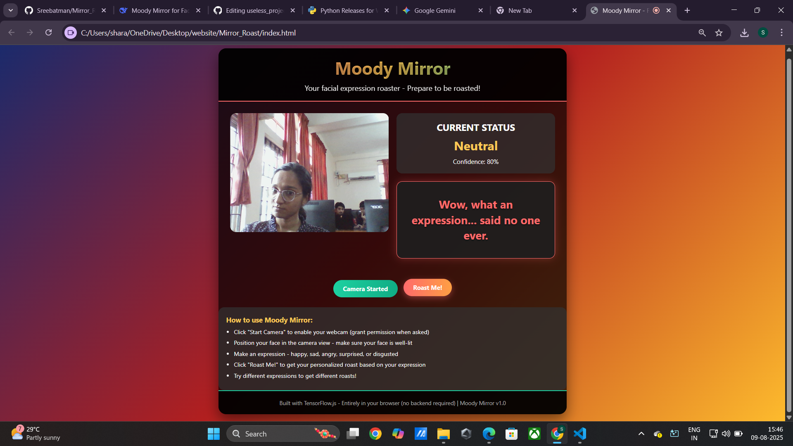

# Moody Mirror 🎯

## Basic Details
### Team Name: Stack Hackers

### Team Members
- Team Lead: Sreehari C Nair - College Of Engineering Thalassery
- Member 1: Sooraj O - College Of Engineering Thalassery

### Project Description
Moody Mirror is a web application that uses your webcam to detect your facial expressions in real-time and roasts you with hilarious, personalized insults. It's like having a sarcastic friend trapped in your mirror who never runs out of snarky comments about your face.

### The Problem (that doesn't exist)
People are taking themselves too seriously! Facial expressions have become boring and predictable. We noticed a severe lack of sarcastic mirrors that mock you based on how you look. The world needs more pointless humor and less self-esteem.

### The Solution (that nobody asked for)
Moody Mirror combines cutting-edge AI with savage humor to:

1.Analyze your facial expressions using TensorFlow.js

2.Classify your mood (happy, sad, angry, etc.)

3.Generate personalized roasts based on your expression

4.Destroy your self-confidence with surgical precision

## Technical Details
### Technologies/Components Used
For Software:
-Languages: HTML, CSS, JavaScript
-Frameworks: TensorFlow.js
-Libraries: face-landmarks-detection
-Tools: GitHub Pages for hosting

### Implementation
For Software:
# Installation
git clone https://github.com/stack-hackers/moody-mirror.git
cd moody-mirror

### Project Documentation
For Software:

# Screenshots (Add at least 3)

*Add caption explaining what this shows*

*Add caption explaining what this shows*

*Add caption explaining what this shows*

# Diagrams
User Interaction Flow:
[Start Camera] → [AI Model Loading] → [Real-time Detection] → [Expression Classification] → [Roast Generation]

## Team Contributions
Sreehari C Nair: Project architecture, TensorFlow.js implementation, expression classification
Sooraj O: UI/UX design, roast database creation, documentation

---
Made with ❤️ at TinkerHub Useless Projects 

